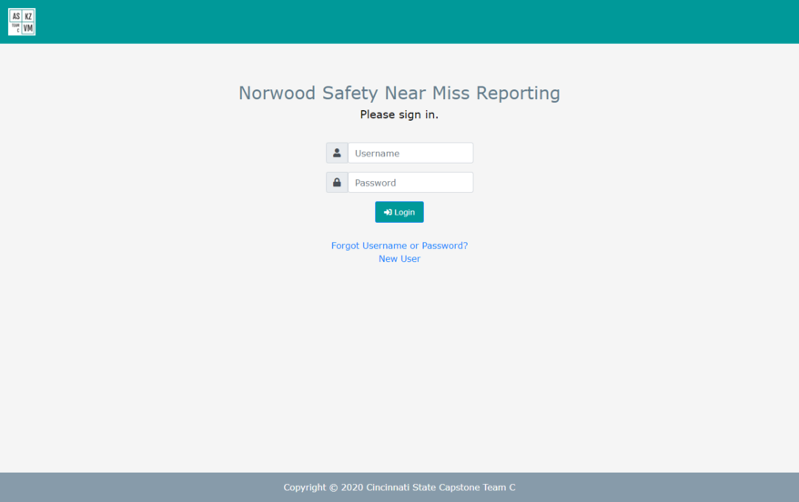
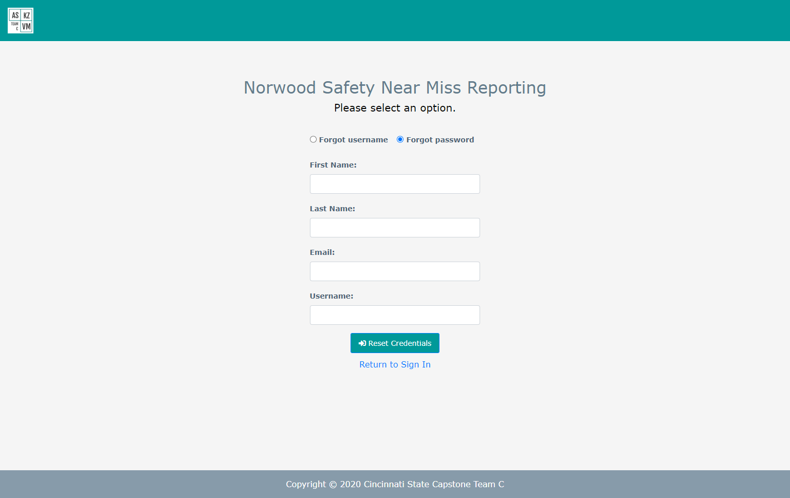
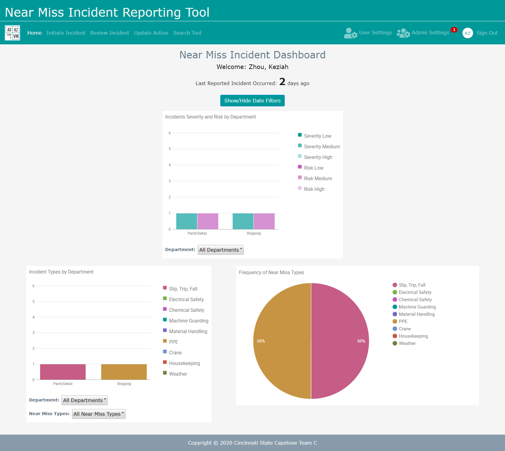
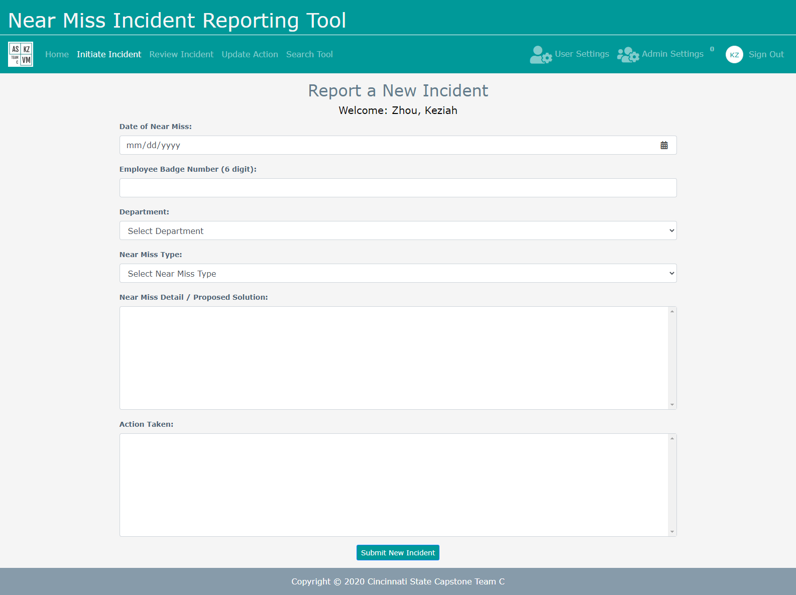
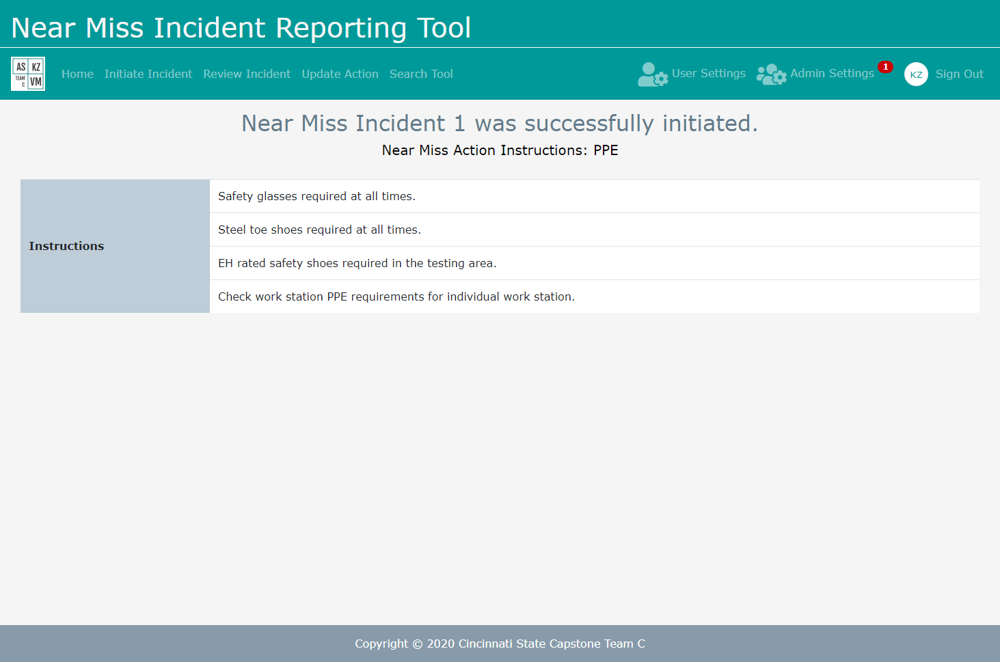
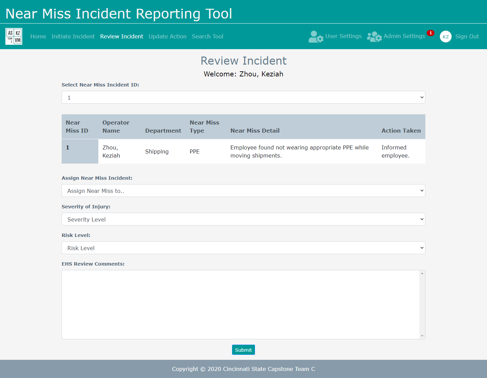
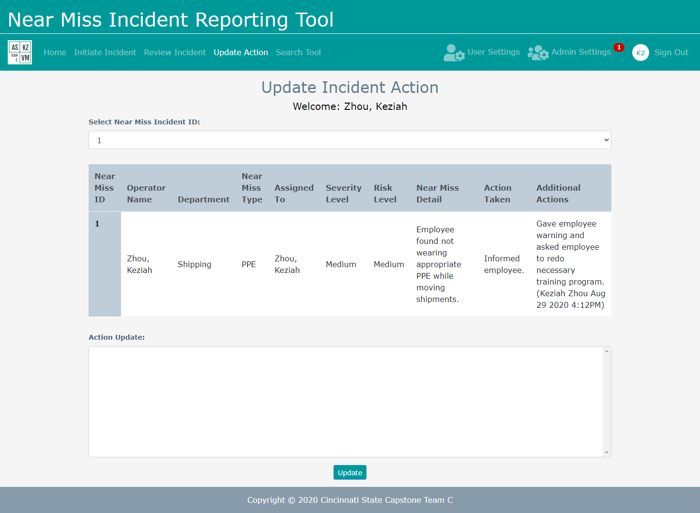
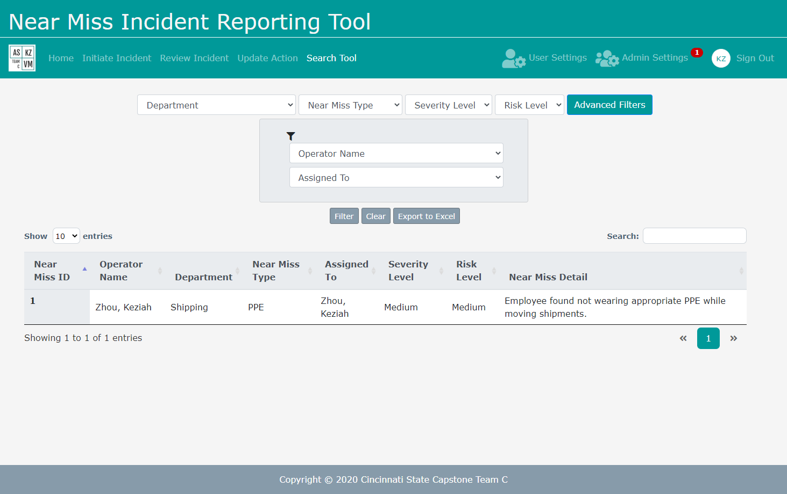
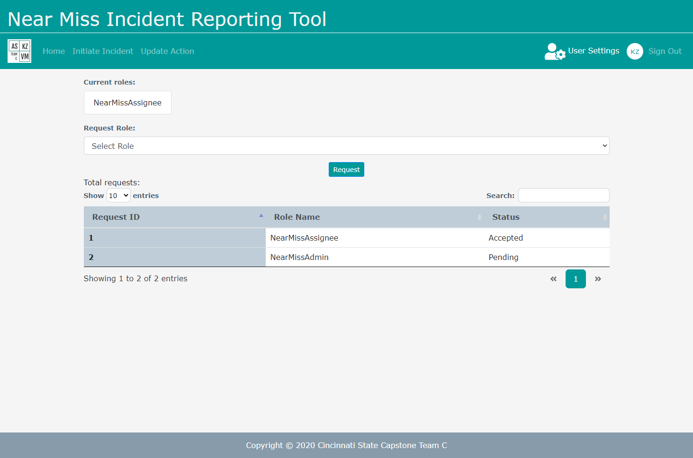
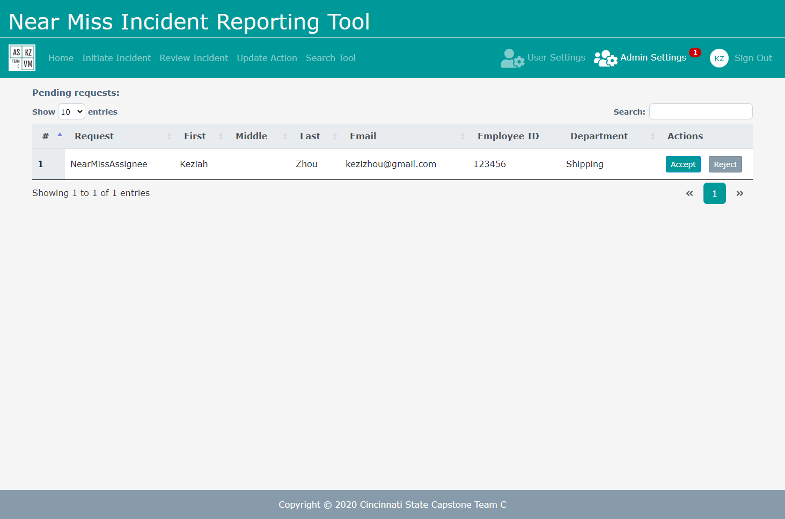

# CState_TeamC_Capstone
A near miss incident reporting tool for the manufacturing industry to report, update, and analyze incidents for trend data

### Technologies Used
- ASP.NET
- HTML
- CSS
- Bootstrap
- C#
- JavaScript
- JQuery

### Sample Screenshots
**Sign In**  
  
***

**Forgot Username/Password**  

**Home**  

***

**Initiate Incident**  

***

**Instructions for Type of New Incident**  

**Review Incident**  

***

**Update Incident**  

***

**Search Tool**  

***

**User Settings**  

***

**Admin Settings**  

***
